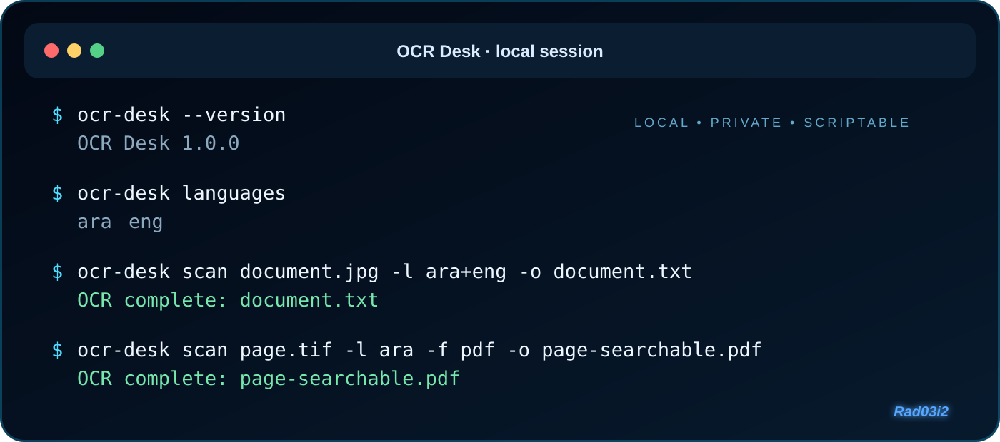
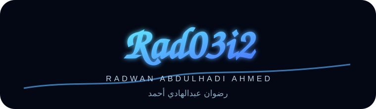

<div align="center">


<br/>

# OCR Desk

### Local-first OCR for reliable document workflows

**استخراج النصوص من الصور محليًا — بخصوصية، وضوح، وتحكم كامل**

<br/>

[](https://github.com/rad03i2/ocr-desk/actions/workflows/ci.yml)


**[🇮🇶 العربية](README_AR.md) · [🇬🇧 English](README_EN.md) · [🧭 Roadmap](ROADMAP.md) · [🧩 Architecture](docs/ARCHITECTURE.md) · [💬 Support](SUPPORT.md)**

<sub>Part of the personal <strong>Rad03i2</strong> project identity · Built by <strong>Radwan Abdulhadi Ahmed</strong></sub>

</div>

---

<div dir="rtl" align="right">

## ✦ المشروع في سطر واحد

**OCR Desk** أداة سطر أوامر خفيفة لتحويل صور المستندات إلى نصوص وملفات قابلة للبحث، مع إبقاء عملية التعرّف على جهاز المستخدم من خلال محرك تيسراكت المثبّت محليًا.

</div>

<table>
<tr>
<td width="25%" align="center"><strong>🔐 محلي أولًا</strong><br/><sub>لا يحتاج المشروع إلى رفع المستندات لخدمة تعرّف سحابية</sub></td>
<td width="25%" align="center"><strong>🌍 متعدد اللغات</strong><br/><sub>العربية والإنجليزية وأي حزمة لغة مثبتة في تيسراكت</sub></td>
<td width="25%" align="center"><strong>⚙️ قابل للأتمتة</strong><br/><sub>أوامر واضحة ونتائج منظمة يمكن استخدامها في السكربتات</sub></td>
<td width="25%" align="center"><strong>🛡️ آمن افتراضيًا</strong><br/><sub>حماية من الاستبدال غير المقصود للملفات</sub></td>
</tr>
</table>

---

## ⚡ 30-second start

> OCR Desk requires **Tesseract OCR** to be installed locally before recognition can run.

```bash
git clone https://github.com/rad03i2/ocr-desk.git
cd ocr-desk
python -m pip install -e .
ocr-desk --version
```

<div dir="rtl" align="right">

### استخراج نص عربي وإنجليزي

</div>

```bash
ocr-desk scan document.jpg -l ara+eng -o document.txt
```

<div dir="rtl" align="right">

### إنشاء ملف قابل للبحث

</div>

```bash
ocr-desk scan page.tif -l ara -f pdf -o page-searchable.pdf
```

<div dir="rtl" align="right">

### معرفة اللغات المثبتة

</div>

```bash
ocr-desk languages
```

<div align="center">

### Terminal preview



</div>

---

## ◈ What OCR Desk handles

| Capability | Current support |
|---|---|
| Image input | PNG · JPEG · TIFF · BMP · WebP |
| Plain text output | TXT |
| Structured OCR output | TSV · hOCR |
| Searchable document output | PDF |
| Multiple OCR languages | ✅ |
| Arabic + English recognition | ✅ when language packs are installed |
| Page segmentation control | ✅ `--psm` |
| OCR engine-mode control | ✅ `--oem` |
| JSON completion result | ✅ `--json` |
| Explicit Tesseract path | ✅ `--tesseract` |
| Existing-output protection | ✅ default behavior |
| Batch-directory mode | 🔭 Roadmap |
| Desktop GUI | 🔭 Roadmap |
| Image preprocessing | 🔭 Roadmap |

---

<div dir="rtl" align="right">

## 🔐 الخصوصية ليست إضافة جانبية

المشروع لا يحتاج إلى حساب مستخدم أو مفتاح واجهة برمجية لخدمة تعرّف خارجية. عملية التعرّف نفسها تُنفّذ عبر ملف تيسراكت التنفيذي الموجود على جهازك، والصورة الأصلية لا تُعدّل عمدًا.

هذا لا يعني أن الناتج غير حساس: النص المستخرج قد يحتوي معلومات خاصة، لذلك يجب التعامل مع ملفات الإخراج بنفس مستوى حماية المستند الأصلي.

**التفاصيل:** [سياسة الأمان](SECURITY.md)

</div>

---

## 🧪 Tested across platforms

The GitHub Actions matrix installs the package, runs the test suite, and performs a CLI smoke test across:

| Operating system | Python versions |
|---|---|
| Ubuntu | 3.10 · 3.12 · 3.13 |
| Windows | 3.10 · 3.12 · 3.13 |
| macOS | 3.10 · 3.12 · 3.13 |

That gives the repository a **9-environment CI matrix** for the currently configured workflow.

---

## 🗺️ Repository experience

```text
ocr-desk/
├── assets/                    branded visual identity
│   ├── ocr-desk-brand-cover.svg
│   ├── ocr-desk-terminal.svg
│   └── rad03i2-signature.svg
├── docs/
│   ├── ARCHITECTURE.md        technical architecture
│   └── BRAND.md               Rad03i2 visual rules
├── src/ocr_desk/              application source
├── tests/                     automated tests
├── .github/
│   ├── ISSUE_TEMPLATE/        bug / feature forms
│   ├── CODEOWNERS             repository ownership
│   ├── PULL_REQUEST_TEMPLATE.md
│   ├── release.yml            release-note categories
│   └── workflows/             CI
├── README_AR.md               الدليل العربي الكامل
├── README_EN.md               full English guide
├── ROADMAP.md                 future direction
├── SUPPORT.md                 support guide
├── SECURITY.md                security policy
├── CONTRIBUTING.md            contribution guide
├── CODE_OF_CONDUCT.md         community expectations
├── CHANGELOG.md               release history
└── LICENSE                    MIT License
```

---

## 📚 Explore the project

| Resource | Purpose |
|---|---|
| [🇮🇶 README_AR.md](README_AR.md) | الدليل العربي الكامل |
| [🇬🇧 README_EN.md](README_EN.md) | Complete English guide |
| [🧭 ROADMAP.md](ROADMAP.md) | Planned evolution and future ideas |
| [🧩 Architecture](docs/ARCHITECTURE.md) | How the CLI, core, Tesseract, and output flow connect |
| [✦ Brand identity](docs/BRAND.md) | Visual identity and Rad03i2 presentation rules |
| [💬 SUPPORT.md](SUPPORT.md) | Troubleshooting and support guidance |
| [🧪 CONTRIBUTING.md](CONTRIBUTING.md) | Contribution workflow |
| [🔐 SECURITY.md](SECURITY.md) | Security and privacy guidance |
| [📝 CHANGELOG.md](CHANGELOG.md) | Release history |

---

## 🧭 Direction

OCR Desk intentionally starts with a small, dependable command-line surface. Future work is organized around three areas: better batch usability, optional image preparation, and a possible lightweight desktop experience — without sacrificing the local-first CLI foundation.

**See the full direction:** [ROADMAP.md](ROADMAP.md)

---

<div align="center">



### ✦ A Rad03i2 Project

**Radwan Abdulhadi Ahmed**  
**رضوان عبدالهادي أحمد**  
**[@rad03i2](https://github.com/rad03i2)**

`SIMPLE TOOLS · REAL IMPACT`

<br/>

Built with a focus on **privacy · reliability · clarity · automation**

</div>
