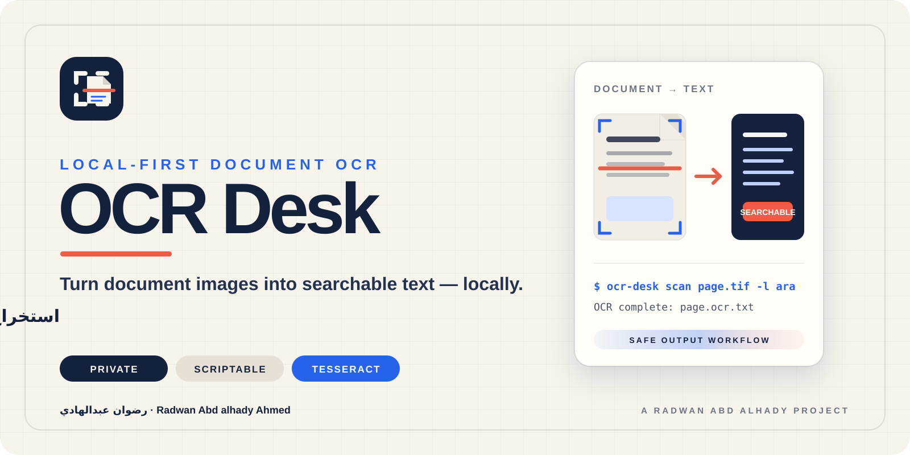
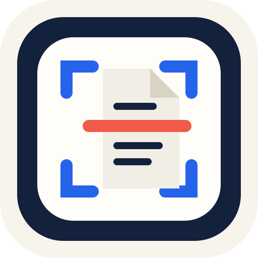
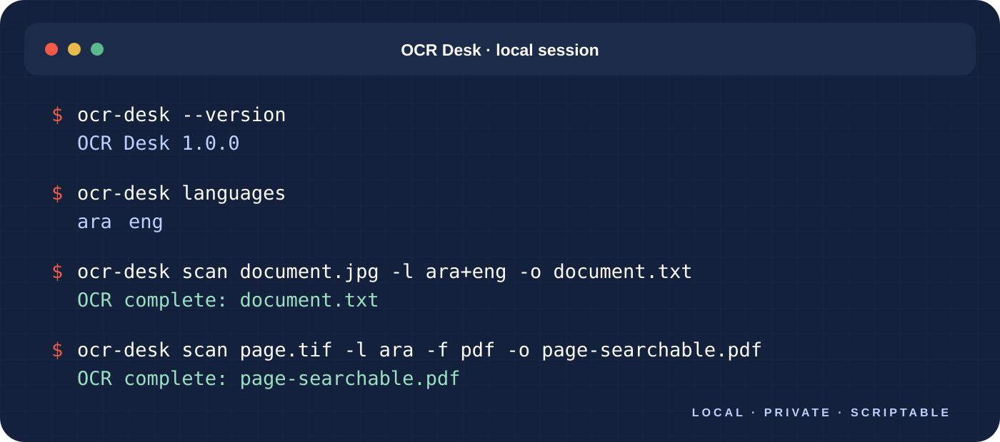

<div align="center">



<br/>



# OCR Desk

**Local-first OCR for document images, multilingual text, and searchable PDF output.**

<div dir="rtl">
<strong>أداة OCR محلية لتحويل صور المستندات إلى نصوص ومخرجات قابلة للبحث، من دون الاعتماد على خدمة تعرّف سحابية.</strong>
</div>

<br/>

[](https://github.com/rad03i2/ocr-desk/actions/workflows/ci.yml)


**[العربية](README_AR.md) · [English](README_EN.md) · [Architecture](docs/ARCHITECTURE.md) · [Roadmap](ROADMAP.md) · [Security](SECURITY.md)**

</div>

---

## What OCR Desk is

OCR Desk is a compact Python command-line tool that wraps an installed **Tesseract OCR** engine with input validation, safer output handling, multilingual recognition options, and script-friendly results.

It is intentionally local-first: OCR Desk itself does not upload source images or recognized text to a remote OCR service.

<table>
<tr>
<td width="25%"><strong>Local processing</strong><br/><sub>Recognition runs through the Tesseract executable selected on your machine.</sub></td>
<td width="25%"><strong>Multilingual OCR</strong><br/><sub>Use one or multiple installed Tesseract language packs such as <code>ara+eng</code>.</sub></td>
<td width="25%"><strong>Useful outputs</strong><br/><sub>Generate TXT, TSV, hOCR, or searchable PDF from supported image input.</sub></td>
<td width="25%"><strong>Safe by default</strong><br/><sub>Existing output is protected unless overwrite is explicitly requested.</sub></td>
</tr>
</table>

## 30-second start

> **Requirement:** Tesseract OCR must be installed locally before recognition can run.

```bash
git clone https://github.com/rad03i2/ocr-desk.git
cd ocr-desk
python -m pip install -e .
ocr-desk --version
```

Recognize Arabic and English text:

```bash
ocr-desk scan document.jpg -l ara+eng -o document.txt
```

Create a searchable PDF:

```bash
ocr-desk scan page.tif -l ara -f pdf -o page-searchable.pdf
```

List locally installed Tesseract languages:

```bash
ocr-desk languages
```

<div align="center">



</div>

---

## Current capabilities

| Area | Supported now |
|---|---|
| Image input | PNG · JPEG · TIFF · BMP · WebP |
| Text output | TXT |
| Structured OCR output | TSV · hOCR |
| Searchable document output | PDF |
| Multiple recognition languages | Yes |
| Arabic + English recognition | Yes, when the corresponding language packs are installed |
| Page segmentation | `--psm` modes 0–13 |
| OCR engine mode | `--oem` modes 0–3 |
| Machine-readable completion result | `--json` |
| Explicit Tesseract executable | `--tesseract PATH` |
| Existing-output protection | Enabled by default |
| Batch directory processing | Roadmap |
| Image preprocessing | Roadmap |
| Desktop GUI | Roadmap |

## How the workflow stays predictable

```text
document image
     │
     ▼
input + format validation
     │
     ▼
local Tesseract process
     │
     ▼
temporary OCR output
     │
     ▼
validated final output
```

OCR Desk creates the renderer output under a temporary base name and promotes it to the requested destination only after Tesseract completes successfully. This keeps the source image separate and avoids accidental replacement of an existing output unless `--overwrite` is used.

## CLI examples

Structured completion metadata:

```bash
ocr-desk scan page.png --psm 6 --json
```

Choose the Tesseract executable explicitly on Windows:

```powershell
ocr-desk --tesseract "C:\Program Files\Tesseract-OCR\tesseract.exe" scan page.png -l ara
```

Allow intentional replacement of an existing result:

```bash
ocr-desk scan page.png -o page.txt --overwrite
```

## Privacy and safety boundary

Recognition is delegated to the **local** Tesseract executable. OCR Desk does not require an account, telemetry endpoint, or cloud OCR API.

The generated text can still be sensitive. Treat OCR output with the same care as the source document, and do not pass recognized text directly into shells, templates, or databases without appropriate validation.

See [SECURITY.md](SECURITY.md) for the project security guidance.

## Tests and CI

The repository includes behavioral tests for command construction, input validation, safe output promotion, and overwrite protection.

```bash
python -m unittest discover -s tests -v
```

GitHub Actions currently tests installation, the unit-test suite, and a CLI smoke test on:

| OS | Python |
|---|---|
| Ubuntu | 3.10 · 3.12 · 3.13 |
| Windows | 3.10 · 3.12 · 3.13 |
| macOS | 3.10 · 3.12 · 3.13 |

## Project structure

```text
ocr-desk/
├── assets/
│   ├── project-cover.svg      current repository hero artwork
│   ├── project-logo.svg       current square project mark
│   └── ocr-desk-terminal.svg  command-line preview
├── docs/
│   ├── ARCHITECTURE.md
│   └── BRAND.md
├── src/ocr_desk/
│   ├── cli.py
│   └── core.py
├── tests/
│   └── test_core.py
├── .github/
│   ├── ISSUE_TEMPLATE/
│   ├── PULL_REQUEST_TEMPLATE.md
│   └── workflows/ci.yml
├── README_AR.md
├── README_EN.md
├── ROADMAP.md
├── SECURITY.md
├── CONTRIBUTING.md
├── CHANGELOG.md
└── LICENSE
```

## Current boundaries

OCR Desk currently accepts **image files**, not PDF documents as input. OCR accuracy depends on Tesseract, language data, image quality, orientation, and page layout. Deskewing, denoising, automatic rotation/cropping, directory-batch processing, and a desktop GUI are not part of the current release.

Planned work is kept separate in [ROADMAP.md](ROADMAP.md) so future ideas are not presented as existing features.

## Documentation

| Document | Purpose |
|---|---|
| [README_AR.md](README_AR.md) | Complete Arabic guide |
| [README_EN.md](README_EN.md) | Complete English guide |
| [docs/ARCHITECTURE.md](docs/ARCHITECTURE.md) | Technical flow and component responsibilities |
| [docs/BRAND.md](docs/BRAND.md) | Visual identity system and asset rules |
| [ROADMAP.md](ROADMAP.md) | Planned improvements |
| [SECURITY.md](SECURITY.md) | Privacy and security guidance |
| [CONTRIBUTING.md](CONTRIBUTING.md) | Contribution workflow |
| [CHANGELOG.md](CHANGELOG.md) | Notable project changes |
| [LICENSE](LICENSE) | MIT License |

---

<div align="center">

### Built by رضوان عبدالهادي

**Radwan Abd alhady Ahmed · [@rad03i2](https://github.com/rad03i2)**

<sub>Designed around privacy, predictable file handling, and useful command-line automation.</sub>

</div>
