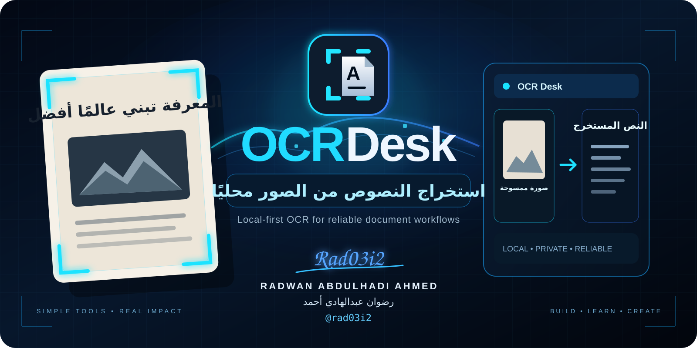

<div align="center">



# OCR Desk — الدليل العربي

**أداة محلية لاستخراج النصوص من الصور وإنشاء مستندات قابلة للبحث مع الحفاظ على الخصوصية.**

[](https://github.com/rad03i2/ocr-desk/actions/workflows/ci.yml)


**[الصفحة الرئيسية](README.md) · [الدليل الإنجليزي](README_EN.md) · [خارطة الطريق](ROADMAP.md) · [الدعم](SUPPORT.md)**

</div>

---

<div dir="rtl" align="right">

## ✦ ما هو المشروع؟

OCR Desk أداة تعمل من سطر الأوامر على جهازك مباشرة. وظيفتها تحويل صور المستندات إلى نصوص قابلة للنسخ والبحث، أو إنشاء ملفات مستندية يمكن البحث داخلها، من دون إرسال الصور أو النصوص إلى خدمة خارجية.

يعتمد المشروع على محرك **تيسراكت** المثبّت محليًا، ويضيف إليه طريقة تشغيل أبسط وأكثر أمانًا، مع التحقق من المدخلات وحماية الملفات من الاستبدال غير المقصود.

## لماذا قد تستخدمه؟

- استخراج النص من صورة مستند أو صفحة ممسوحة ضوئيًا.
- التعامل مع المستندات العربية والإنجليزية.
- إنشاء ملف قابل للبحث من صورة صفحة.
- استخدام النتائج داخل السكربتات وعمليات الأتمتة.
- تنفيذ المعالجة محليًا عندما تكون الخصوصية مهمة.
- الحصول على سلوك ثابت وقابل للتكرار بدل كتابة أوامر طويلة في كل مرة.

## ◈ أهم المزايا

- معالجة محلية بالكامل على جهاز المستخدم.
- دعم عدة صيغ شائعة للصور.
- دعم لغة واحدة أو أكثر في عملية التعرّف نفسها.
- حماية الصورة الأصلية من التعديل.
- منع استبدال ملف موجود ما لم يطلب المستخدم ذلك صراحة.
- إنشاء الناتج مؤقتًا قبل اعتماد الملف النهائي.
- إمكانية عرض حزم اللغات المثبّتة على الجهاز.
- مخرجات مناسبة للاستخدام اليدوي أو داخل الأتمتة.
- لا حسابات ولا مفاتيح وصول ولا تتبع ولا رفع للمستندات.

## صيغ الإدخال

</div>

```text
PNG · JPEG · TIFF · BMP · WebP
```

<div dir="rtl" align="right">

## صيغ الإخراج

</div>

```text
TXT · TSV · hOCR · Searchable PDF
```

<div dir="rtl" align="right">

## ⚙️ المتطلبات

- بايثون، الإصدار 3.10 أو أحدث.
- محرك تيسراكت مثبت على الجهاز.
- حزم اللغات المطلوبة للمستندات التي تريد معالجتها.

تحقق من تثبيت المحرك:

</div>

```bash
tesseract --version
```

<div dir="rtl" align="right">

## 🚀 التثبيت

</div>

```bash
git clone https://github.com/rad03i2/ocr-desk.git
cd ocr-desk
python -m pip install -e .
ocr-desk --version
```

<div dir="rtl" align="right">

## ⚡ تشغيل سريع

### استخراج نص من صورة

</div>

```bash
ocr-desk scan scan.png
```

<div dir="rtl" align="right">

### استخراج نص عربي وإنجليزي

</div>

```bash
ocr-desk scan document.jpg -l ara+eng -o document.txt
```

<div dir="rtl" align="right">

### إنشاء ملف قابل للبحث

</div>

```bash
ocr-desk scan page.tif -l ara -f pdf -o page-searchable.pdf
```

<div dir="rtl" align="right">

### عرض اللغات المثبتة

</div>

```bash
ocr-desk languages
```

<div dir="rtl" align="right">

### استخدام إعداد تحليل صفحة محدد

</div>

```bash
ocr-desk scan page.png --psm 6
```

<div dir="rtl" align="right">

### الحصول على بيانات نتيجة منظمة

</div>

```bash
ocr-desk scan page.png --json
```

<div dir="rtl" align="right">

### تشغيله على ويندوز عند عدم إضافة المحرك إلى مسار النظام

</div>

```powershell
ocr-desk --tesseract "C:\Program Files\Tesseract-OCR\tesseract.exe" scan page.png -l ara
```

<div dir="rtl" align="right">

## 🛡️ حماية الملفات

المشروع مصمم لتقليل أخطاء الاستبدال غير المقصود. إذا كان ملف الإخراج موجودًا مسبقًا فلن يتم استبداله افتراضيًا.

عندما يكون الاستبدال مقصودًا فقط، يمكن استخدام:

</div>

```text
--overwrite
```

<div dir="rtl" align="right">

## 🔐 الخصوصية

المعالجة تتم على جهازك من خلال المحرك المحلي. المشروع نفسه لا يرفع الصورة أو النص الناتج إلى الإنترنت ولا يحتاج إلى حساب مستخدم أو مفتاح وصول.

مع ذلك، قد يحتوي النص الناتج معلومات حساسة، لذلك يجب التعامل مع ملفات الإخراج بنفس مستوى الحماية الذي تتعامل به مع المستند الأصلي.

## 🧩 بنية المشروع

</div>

```text
src/ocr_desk/core.py    منطق التحقق وبناء الأوامر وحماية الإخراج
src/ocr_desk/cli.py     واجهة سطر الأوامر ورموز الخروج
tests/test_core.py      اختبارات السلوك الأساسي
.github/workflows/      اختبارات التكامل المستمر
```

<div dir="rtl" align="right">

لشرح أعمق لتدفق المشروع راجع: [معمارية المشروع](docs/ARCHITECTURE.md).

## 🧪 الاختبارات

</div>

```bash
python -m unittest discover -s tests -v
```

<div dir="rtl" align="right">

تم تصميم الاختبارات بحيث لا تحتاج إلى تشغيل تيسراكت فعليًا في كل حالة، إذ تتم محاكاة التنفيذ عندما يكون ذلك مناسبًا.

كما يختبر GitHub Actions الحزمة على ويندوز وأوبونتو وmacOS عبر عدة إصدارات من بايثون.

## القيود الحالية

- جودة التعرّف تعتمد على جودة الصورة واتجاهها وتخطيط الصفحة وحزم اللغة المثبتة.
- الإدخال الحالي مخصص للصور؛ ملفات المستندات متعددة الصفحات تحتاج إلى تحويل صفحاتها إلى صور أولًا.
- لا توجد في الإصدار الحالي معالجة مسبقة للصور مثل إزالة التشويش أو تصحيح الميل أو القص التلقائي.
- لا توجد واجهة رسومية في الإصدار الحالي.
- لا توجد معالجة مباشرة لمجلد كامل في أمر واحد حاليًا.

## 🧭 مستقبل المشروع

التطويرات المستقبلية موثقة بصورة منفصلة حتى تبقى الميزات الحالية واضحة ولا تختلط بالأفكار القادمة.

**راجع:** [ROADMAP.md](ROADMAP.md)

## 📚 ملفات مهمة

- [دليل الدعم](SUPPORT.md)
- [سياسة الأمان](SECURITY.md)
- [دليل المساهمة](CONTRIBUTING.md)
- [خارطة الطريق](ROADMAP.md)
- [معمارية المشروع](docs/ARCHITECTURE.md)
- [هوية المشروع](docs/BRAND.md)
- [سجل التغييرات](CHANGELOG.md)
- [الترخيص](LICENSE)

## المطور

**رضوان عبدالهادي أحمد**  
**Radwan Abdulhadi Ahmed**  
GitHub: **@rad03i2**

</div>

---

<div align="center">

### ✦ A Rad03i2 Project

`SIMPLE TOOLS · REAL IMPACT`

</div>
